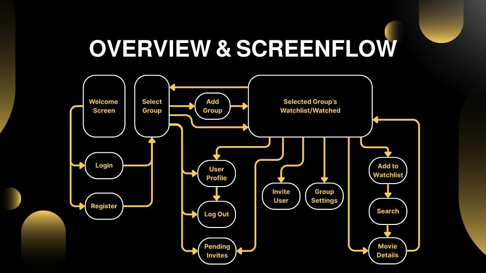

> ## This is a public version of a previously private group project created for portfolio purposes. Any sensitive information (API keys, credentials, etc.) has been removed.

# [CineSync](https://cinesync115a.web.app/): Movie Watchlist App
> Collaborative movie lists for friends & family: invite people, search movies, vote, and pick something fair for everyone.

## Features

- Invite & Join Groups
- Search Movies and View Details (OMDb API)
- Sort by Likes/Dislikes or Rotten Tomatoes Percentage
- “Fairness” Filter 
- User Authentication (Login/Signup)
- Real-time Updates with Firebase Database

## Tech Stack

- React Native (Expo)
- Firebase (Auth, Firestore, Hosting, Security Rules)
- OMDb API (Movie Metadata)

## Contributors

- [Mariah Balandran](https://github.com/mbalandr): Design, Screenflow, Prototype & Mockup
- [Julien Howard](https://github.com/julienphoward): Backend & API
- [Daniel Villalon](https://github.com/Daniel-Villalon): Backend & Database
- [Bryce Takaha](https://github.com/BryTak1): Backend & Database
- [Edmund Xu](https://github.com/edmund-xu): Frontend & Backend

## Screenflow

## Design Documents

- [Brainstorm Figma Design Board](https://www.figma.com/design/ZAgfKoexXckcku6M1iozWG/CineSync-Design-Board--Old-?node-id=0-1&t=UNeiQfLPtc6asplU-1)
- [Final Figma Design Board](https://www.figma.com/design/SJw5vqUjlKNq8CAiA2KmO6/CineSync-Design-Board?node-id=0-1&t=NE6HCwGw02lU3sQb-1)
- [Figma Interactive Prototype](https://www.figma.com/proto/SJw5vqUjlKNq8CAiA2KmO6/CineSync-Design-Board?node-id=758-553&starting-point-node-id=758%3A553&t=6hldqf8M7yfULhY5-1)
